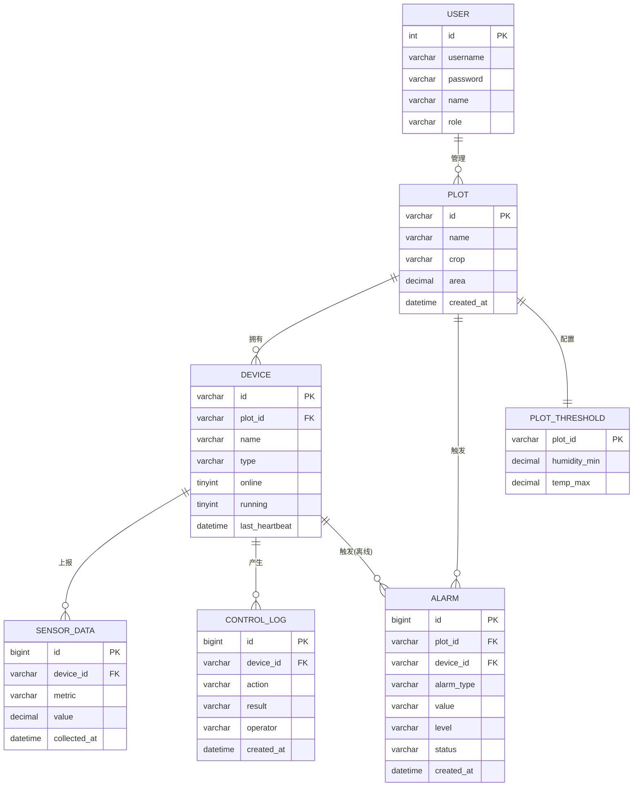

# 智慧农业 - 数据类型与 ER 设计（概念设计层）

> 依据：`01_智慧农业_基本功能清单.md`
> 定位：**概念设计**——实体、属性及数据类型、关系与基数，用于画 ER 图。
> 配套：`数据库设计.md`（物理建表层初稿），两份文档保持一致，本文偏概念。

---

## 一、需求 → 实体梳理

| 功能序号/用户故事 | 提取出的实体 | 关键属性线索 |
|---|---|---|
| 查看土壤湿度/温度（1-1） | 传感器数据、设备 | 指标类型、数值、采集时间 |
| 历史数据趋势 | 传感器数据 | 按时间序列查询 |
| 灌溉开关控制 | 设备、控制日志 | 运行状态、操作留痕 |
| 阈值告警（2-1） | 告警阈值、告警 | 阈值参数、告警类型/级别/状态 |
| 设备状态监控 | 设备 | 在线状态、心跳时间 |
| 灌溉智能问答 | （知识库，不在关系库） | — |
| 多地块总览 | 地块、设备 | 地块聚合信息 |
| 设备绑定管理 | 设备、地块 | 绑定关系 |
| 告警日志查看 | 告警 | 历史列表 |
| 三种角色（农户/农场管理员/系统管理员） | 用户 | 角色、登录 |

**结论：核心实体 7 个** —— 用户、地块、设备、传感器数据、告警阈值、告警、控制日志。（智能问答走 RAG 知识库，不落在关系库里。）

---

## 二、实体与属性（含数据类型）

> 数据类型分两列：**概念类型**（画 ER 图/概念设计用）+ **建议 MySQL 类型**（落地用）。主键/外键已标注。

### 1. 用户（user）— 支撑登录与角色权限

| 属性 | 概念类型 | MySQL 类型 | 说明 |
|---|---|---|---|
| 用户ID | 整型 · PK | `INT` 自增 | |
| 用户名 | 字符串 | `VARCHAR(50)` UNIQUE | 登录账号 |
| 密码 | 字符串 | `VARCHAR(100)` | 存哈希，不存明文 |
| 姓名 | 字符串 | `VARCHAR(50)` | 显示名 |
| 角色 | 枚举 | `VARCHAR(20)` | 农户 / 农场管理员 / 系统管理员 |

### 2. 地块（plot）

| 属性 | 概念类型 | MySQL 类型 | 说明 |
|---|---|---|---|
| 地块ID | 字符串 · PK | `VARCHAR(16)` | `P001`，前端 URL 要用，须稳定 |
| 名称 | 字符串 | `VARCHAR(50)` | 如"一号大棚" |
| 作物 | 字符串 | `VARCHAR(50)` | 如"番茄" |
| 面积 | 数值 | `DECIMAL(8,2)` | 单位亩，只存数字 |
| 创建时间 | 日期时间 | `DATETIME` | |

> ⚠️ 设备数 / 在线数 / 实时温湿度是**聚合派生字段**，不存表，查询时算。

### 3. 设备（device）

| 属性 | 概念类型 | MySQL 类型 | 说明 |
|---|---|---|---|
| 设备ID | 字符串 · PK | `VARCHAR(16)` | `D001` |
| 所属地块ID | 字符串 · FK | `VARCHAR(16)` | → plot.id |
| 名称 | 字符串 | `VARCHAR(50)` | |
| 类型 | 枚举 | `VARCHAR(20)` | 土壤湿度传感器 / 温度传感器 / 灌溉设备 |
| 在线状态 | 布尔 | `TINYINT` | 1在线 / 0离线（心跳超时置离线） |
| 运行状态 | 布尔 | `TINYINT` | 灌溉开关，仅灌溉设备用 |
| 最后心跳时间 | 日期时间 | `DATETIME` | 在线判断依据 |
| 创建时间 | 日期时间 | `DATETIME` | |

> "是否可控制"不存，由 `类型 == 灌溉设备` 推导。

### 4. 传感器数据（sensor_data）— 弱实体 / 时间序列，写入最频繁

| 属性 | 概念类型 | MySQL 类型 | 说明 |
|---|---|---|---|
| 数据ID | 整型 · PK | `BIGINT` 自增 | |
| 设备ID | 字符串 · FK | `VARCHAR(16)` | → device.id |
| 指标 | 枚举 | `VARCHAR(20)` | `temp` 温度 / `humidity` 湿度 |
| 数值 | 数值 | `DECIMAL(8,2)` | |
| 采集时间 | 日期时间 | `DATETIME(3)` | 毫秒精度，建联合索引 |

### 5. 告警阈值（plot_threshold）— 每地块一行

| 属性 | 概念类型 | MySQL 类型 | 说明 |
|---|---|---|---|
| 地块ID | 字符串 · PK/FK | `VARCHAR(16)` | → plot.id，每地块一行 |
| 湿度下限 | 数值 | `DECIMAL(5,2)` | %，默认 40 |
| 温度上限 | 数值 | `DECIMAL(5,2)` | ℃，默认 35 |
| 更新时间 | 日期时间 | `DATETIME` | 自动更新 |

> 每个地块一条阈值配置；未配置的地块用默认值（湿度 40%、温度 35℃）。

### 6. 告警（alarm）

| 属性 | 概念类型 | MySQL 类型 | 说明 |
|---|---|---|---|
| 告警ID | 整型 · PK | `BIGINT` 自增 | |
| 地块ID | 字符串 · FK | `VARCHAR(16)` | → plot.id |
| 设备ID | 字符串 · FK | `VARCHAR(16)` 可空 | 离线告警时填 |
| 告警类型 | 枚举 | `VARCHAR(30)` | 土壤湿度过低 / 温度过高 / 设备离线 |
| 触发值 | 字符串 | `VARCHAR(20)` | 展示型，带单位，如 `38%`、`36.5℃` |
| 级别 | 枚举 | `VARCHAR(10)` | 严重 / 警告 |
| 状态 | 枚举 | `VARCHAR(10)` | 未处理 / 已处理 |
| 创建时间 | 日期时间 | `DATETIME` | |
| 处理时间 | 日期时间 | `DATETIME` 可空 | |
| 处理人 | 字符串 | `VARCHAR(50)` 可空 | |

### 7. 控制日志（control_log）— 灌溉操作留痕

| 属性 | 概念类型 | MySQL 类型 | 说明 |
|---|---|---|---|
| 日志ID | 整型 · PK | `BIGINT` 自增 | |
| 设备ID | 字符串 · FK | `VARCHAR(16)` | → device.id |
| 动作 | 枚举 | `VARCHAR(10)` | 开启 / 关闭 |
| 结果 | 枚举 | `VARCHAR(10)` | 成功 / 失败 |
| 操作人 | 字符串 | `VARCHAR(50)` | |
| 创建时间 | 日期时间 | `DATETIME` | |

---

## 三、实体间关系与基数（Cardinality）

| 关系 | 基数 | 说明 |
|---|---|---|
| 用户 — 地块 | 1 : N（可选） | 农场管理员管理下辖多个地块 |
| 地块 — 设备 | 1 : N | 一个地块多台设备 |
| 设备 — 传感器数据 | 1 : N | 一台设备持续上报 |
| 设备 — 控制日志 | 1 : N | 灌溉操作留痕 |
| 地块 — 告警 | 1 : N | 地块产生告警 |
| 设备 — 告警 | 1 : N（部分参与） | 离线告警才关联设备 |
| 地块 — 阈值 | 1 : 1 | 每地块一行阈值配置 |

---

## 四、ER 图（Mermaid，可直接渲染）

---

## 五、几个概念设计层面的提醒

1. **派生字段不要画成实体属性**：地块的"设备数 / 在线数 / 实时温湿度"是聚合结果，ER 图里标为派生即可，不落库。
2. **弱实体**：`sensor_data` 和 `control_log` 依赖设备而存在，概念上是弱实体，可用双线框表示。
3. **主键策略两条**：业务对象（用户、地块、设备）用业务字符串/整型稳定键；日志类（传感器数据、告警、控制日志）用自增 `BIGINT`。
4. **阈值按地块配置**：`plot_threshold` 与地块 1:1，每地块一行；未配置的地块用默认值。
5. 智能问答的知识库（RAG）不在关系库，概念图里可用独立节点标注"外部系统"。
